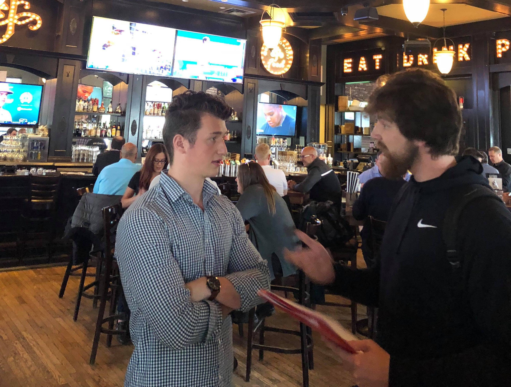
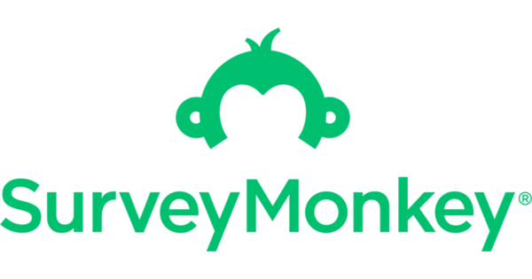
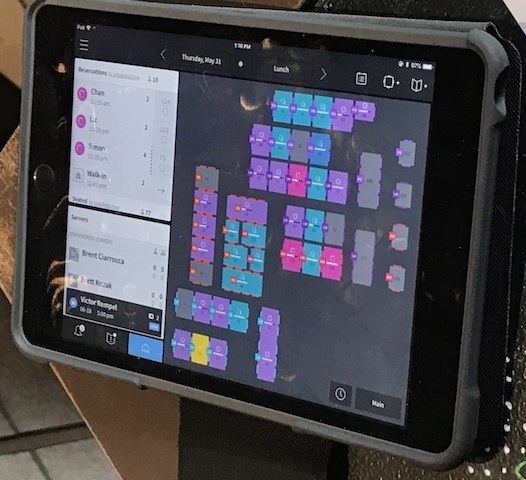

# P1: User Research

## Project Idea

The primary focus of this web-based application is to provide prospective restaurant customers the seat availability and wait times for restaurants of their choice. The customers can view all available tables, as well as wait times for such tables, based on restaurant type, table type (e.g. patio, bar, etc.), number of patrons, and other filters. They also have the option to submit a reservation for a particular table if need be. 

On the restaurant side, the host stand manages all of its seating and reservations through the interface that illustrates the floor plan of the restaurant complete with every table and their respective number of seats. As the restaurant interacts with the app during service, the app will continuously draw all of the relevant data needed to perform wait time calculations and statistics which is displayed to the customers. 

Some may begin thinking that SeatSeeker encapsulates all of the functionality that services like OpenTable and Bookenda already offer. The distinguishing feature of SeatSeeker is providing users with the ability to actively view the wait times of prospective restaurants through the use of statistical analysis on the average time customers spend at the restaurant and other factors. It is worth noting that while SeatSeeker is able to register reservations at participating restaurants, the main use case is to provide a convenient method for users to quickly view restaurant wait times for walk-in customers. 

## Stakeholders and Users

In SeatSeeker, there are two primary users of the system: the restaurants and the customers, with the stakeholders being the restaurants. Both parties would interact with the system, but through different interfaces that are catered to their needs. 

The restaurants will interact with the restaurant-facing user interface in order to manage the seating and reservations during service. They are the beneficiaries in this context as they are investing our system with the goal of increasing their customer traffic. These users will require more training/experience with the app because it involves restaurant-specific knowledge. This includes the overall table layout of the restaurant as well as the tables’ respective number of chairs in order to understand how to manage the seating during service. 

Some older, more traditional restaurants, however, still rely on a manual process (e.g. using pen and paper) to carry out their seating tasks. In situations like this, such users are generally members of an older demographic, meaning that they may be much less technically-adept when using apps. A more in-depth training session will be needed for users like this, but the larger challenge would be to inspire this older audience to introduce our system into their restaurant’s workflow. A further discussion of this is highlighted later on in this report. 

As for the customers who are using the system to find a restaurant, they will need much less prior knowledge when compared to the restaurant users. They need an idea of what type of restaurant they are interested in and the timing of when they would like to get a table. Once they have determined that, the filtering functionality will take care of exposing the subset of restaurants that match the users’ needs. A basic understanding of how to navigate throughout SeatSeeker and the ability to utilize the filtering functionality is all the technical knowledge the users require. 

## User Research Methods

Given the context of our project idea, we moved forward with using interviews and online user surveys to gain more insight into the eventual design of SeatSeeker and validate the feasibility of our proposed ideas.  

It is important to note that we carried out our interviews solely with restaurant managers because we felt that they could give us a stronger understanding of the overall workflow in this particular context. The online user surveys were broadcasted to the general public (via social media) as it is a faster method of getting a large data sample in relatively short window of time. 

This section of the report will illustrate the justifications for why we used each research method, how we executed each investigation, and a summary of our findings. 

### User Research Method 1: Interviews

For our first research method, we decided to perform interviews with various restaurant managers at different restaurants in the North West of Calgary, and also a higher end distillery in Banff. We were sure to choose restaurants of different sizes, styles and popularity. We chose both franchises and local one location bars to broaden our sample. This also allowed for us to see the different types of seating and booking systems that the restaurants had in service. We asked each manager the same set of questions regarding reservations and seating, as well as their willingness to implement a new reservation style app. We were able to interview three restaurant managers in-person and one over email due to the location of the restaurant: 

1. **Do you use an app to manage the seating and reservations at your restaurant during service?**
     * _We wanted to see out of all the restaurants we interviewed, which ones were following a technological approach to their seating. This would allow us to get an idea as to what percentage of restaurant are more tech forward in order to gauge how much training would be required to properly teach a host/hostess to interact with a system like ours._
     * _If yes:_
     1. **What app do you use?**
         * _This question allowed us to see which apps are most commonly being used in the industry for seating. Once we have an understanding of those apps, we can then perform a heuristic evaluation on each of them and in turn help us to develop a stronger application by applying the good design principles that they implemented._ 
     2. **In your opinion, does the app make service run more efficiently?**
         * _Again, this gave us more insight into the level of satisfaction with the current apps that are in place in said restaurant._
     * _If no:_
     1. **Do you encounter much human error when carrying out such tasks during service? (e.g. forgetting to cross off table, double/triple seating a server's section, etc.)**
         * _By assessing the level of human error involved in the restaurant industry, we can further predict the demand for an application such as ours. By analyzing where errors most commonly occur, we can leverage the use of technology to automate manual processes._
     2. **Would you consider implementing an app to help with such tasks?**
         * _This helped us to consider the willingness of a more traditional style restaurant to convert to a technological service._

2. **Are you on restaurant reservation apps like OpenTable or Bookenda?**
     * _Learning about the ways in that the restaurant handles it's reservations, again provides more information that we can use in helping our reservation feature._
     
3. **Is it uncommon for your restaurant to lose customers due to long wait times?**
     * _By seeing how frequently it is for a restaurant to lose customers due to a longer wait time we can see how much utility an app like ours would have in regards to being able to see said wait times before attending a certain restaurant._
     
4. **With the ability for customers to reserve certain types of tables, how do you think it would impact your business/operations?**
     * _This allowed for us to see if there is a market for a feature such as selecting a seat in a restaurant. It also opens up the conversation to see if that’s something a restaurant is logistically able to do/would want to do._
     
5. **Do you think the opportunity to promote specials through apps like OpenTable would increase traffic on off days (e.g. Tuesdays)?**
     * _Again provides insight to us whether this is functionality that a restaurant would want while also allows us to ask how they currently market their specials (i.e. social media)._
     
#### Interview Findings
**NOTE:** To view the emails exchanged when interviewing the restaurant over email, please follow this URL: https://1drv.ms/u/s!An279VoIadgLhH06UG5toEx4cxKi

After performing the interviews on managers from several restaurants, we found the following trends:

* The majority of larger franchises tend to use an app for their seating and booking, whereas the smaller single-location restaurants opt for a paper and marker style approach.
* Restaurants using an app for seating and reservations encountered much less human error as opposed to those still using manual entry.
* Restaurants not currently using an app were somewhat enthusiastic about making a transition to a digital system, but not totally. This is due to the need for upper management to approve and sign off such an idea.
* The locations we visited did not typically lose customers due to long wait times except on very popular nights (wing night, UFC fights, etc.)
* With the ability to choose the type of seating in a restaurant, the managers felt it was a very complex problem with reservations because of varying sizes of parties. The booking process they currently have in place allows them to move people around in order to accommodate as many people in their location as possible. For instance, a party of 12 require they move tables around to accommodate.
* Most agreed that another outlet to promote specials would be useful. However, one restaurant did not want this feature as they felt it would bring in customers that are looking for a 'deal' and not an experience.

### User Research Method 2: Online Survey

We’ve decided collect data using an online survey for a few reasons. Firstly, our app is targeted towards individuals who are familiar with using web-based applications. Thus, using an online survey and distributing it via social media helps target a more specific representative sample of individuals that we believe are more likely to use our app. Secondly, survey statistics are easy to represent visually and make trends of. Lastly, surveys are able to collect large amounts of data within a short amount of time. Having a larger volume of replies will lower the variance of the data and give a better idea of where allocate our time when designing prototypes.

Please follow the URL below to view the survey questions and the results:

     https://www.surveymonkey.com/results/SM-MY5C56ZYL/

Below are the justifications for why we chose to include each question in our online survey:

1. This question allows us to have a rough idea of the current waiting times on average. If the wait time is long, then we can focus on the scheduling and seat reserving aspects of the app. If it is short, then we can focus on aspects such as reviews and recommendations. 

2. Knowing how long people are willing to wait for their favorite restaurant gives insight to how long people are willing to wait in general. Obviously, if someone is only willing to wait for x amount of time for their favorite restaurant, then they will not be willing to wait for an average restaurant longer than x.

3. Whenever someone want to dine out without a specific restaurant, they are blasted to many choices. Knowing if most individuals research beforehand will help us decide if we want to allocate more resources into the display of restaurant information on the app.

4. This is to know where our app stands in the current market. If the majority of people are already using sear reserving apps, then it means that we must be creative to stand out from the rest. However, if most people do not use the apps, then focusing on just the core functionalities will suffice. 

5. Restaurant rating is a functionality that we can implement and integrate into the app. Knowing the importance of ratings will more accurately tell us to what extent to implement the functionality.

6. We wanted to know how important the experiences of peers are. A peer recommendation functionality can be implemented. Knowing the importance will again help us determine where to allocate our resources and time.

7.  If we were to implement a seat reserving service there must be some form of repercussion if the customer were to not show (without notice) up so that businesses could minimize any losses incurred.

8. We wanted to get a good idea of what is an acceptable stay time for peak hours.

9. Asking how often each participant goes out to eat allows us to filter each category and compare preferences of those who go often and those who do not.

10. We wanted to gauge the importance of  friend recommendations when someone is deciding on which restaurant to visit. 

## Reflections
Found below are our reflections on each investigation, specifically, analyzing how we carried each investigation as well as a deeper look into our findings.

### Interviews
Overall, we are quite satisfied with how our investigation turned out due to the quality of the feedback that we received. All of the restaurant managers who we interviewed were more than willing to provide us with functional feedback that will play a vital role in our ideation phase. The variety of restaurants captured in our data sample allowed us to view our proposed solution from different angles, which will help us define our target audience. In hindsight, one thing that may have helped broaden our sample would be to have visited restaurants that are located in busier areas (e.g. downtown, 17th Avenue, etc.). Having feedback collected from such locations would have given us an additional point of view that we may have missed in our investigation. 

With the results from our interviewing experience, we found that our target restaurants would be the larger franchises as they are more accepting of change as well as integrating technological solutions. The ability to choose seating was a problem for most places, so that would require more thought into how we can implement it efficiently. Most restaurants liked the ability to promote their specials on our application so that would be functionality we would put precedence on.  

### Online User Surveys
Using a survey to gather the data also has problems. The survey questions may not address all possible answers that are possible. This is an issue with all multiple choice questions. Another issue is with bots. Not all participants may be genuine people. Lastly, the survey was shared on social media platforms by us. This creates a sample bias since only our peers participated.

From the data we’ve acquired, some interesting observations can be made. Many busy restaurants must be careful with their wait times, since making the customers wait more than 28 minutes will most likely result in them going to another restaurant, and so the restaurant loses the customer. It is logical to deduce that participants are willing to wait much less for the average restaurant. When dining without a specific restaurant in mind, most participants will research beforehand. Since most participants are willing to do some restaurant research, we should focus on integrating our service into the process of finding a restaurant, (i.e. making an extension for Google Maps). Another interesting observation is that the vast majority of participants will mention their experiences with restaurants when deciding where to dine out with friends. This gives us another opportunity to integrate a peer recommendation system within our application. This is compounded with the fact that most participants are more likely to visit a restaurant that has been recommended by a friend. Lastly, there is a relatively even split between people who are willing to reserve a table knowing that there will be a fine for not showing up, allowing restaurants to provide seat reservation services without the fear of losing business. This is especially useful because it gives managers the opportunity to schedule their busy hours with more certainty. 

## Task Descriptions
This section will briefly illustrate the general workflow for both types of users (i.e. restaurants and customers):

### Restaurant
1. Provide sufficient information regarding menus, maximum seating time, ongoing specials, and other dining details. (See photo for an example of restaurant-facing UI of OpenTable):

2. Manage the seating of walk-in customers in conjunction with the reservations during service via the restaurant-facing interface.
3. Set the restaurant preferences for seat reservation options (e.g. how much to charge for seat reservations (if any); penalties for not showing up for a reservation; etc.).

### Customers
1. Determines the type of restaurant desired as well as the timing of when they would like to get a table (e.g. "_I want to find a Mexican restaurant and I don't want to wait longer than 15 minutes for a table_").
2. Enters the desired features into SeatSeeker's filtering menu.
3. Views all restaurants that match the inputted filters and displays basic info regarding the restaurant as well as the calculated estimated wait time (e.g. SeatSeeker exposes all Mexican restaurants with a wait time less than 15 minutes).
4. Selects a restaurant and checks into the wait line.
5. Arrives at restaurant, checks in with host and is directed to table.